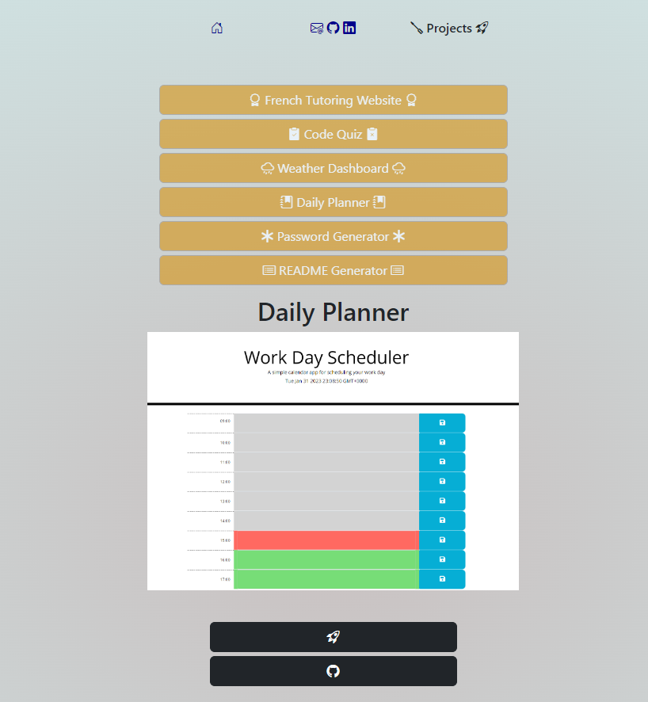

# Ben React App

  

## Description
A Portfolio page designed in React, which showcases my latest projects in a project gallery.

## Table of Contents
  [Screenshot](#Screenshot)

  [Deployed](#Deployed)

  [Installation](#installation)

  [Usage](#usage)

  [License](#license)

  [Contributing](#contributing)

  [Tests](#tests)
  
  [Questions](#questions)
 
## Screenshot

## Deployed
[Deployed Page](https://benedictcodeshere.github.io/ben-react-app/)

## Installation

N/A

## Usage
To use this application, you navigate between the pages using the buttons on the screen. You can find my projects under the Projects tab, and you can find my contact information in the Contact tab.

You can submit a message to my email address using the contact form provided. This uses the [web3forms](https://web3forms.com/) template.

## License

This application is covered by the Apache license.

## Contributing

Thanks to Tony Croft for allowing me to use his ContactForm template.
[anthonycroft](https://github.com/anthonycroft)

## Tests

N/A

## Questions
If you have any questions about this application, please find a link to my Github profile and my email below:

[BenedictCodesHere](https://github.com/BenedictCodesHere)

codingwithbenedict99@gmail.com

